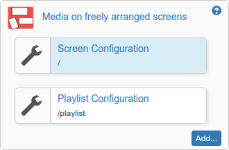
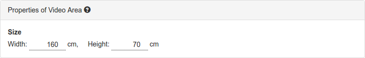
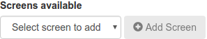
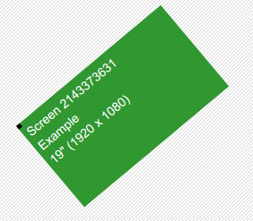
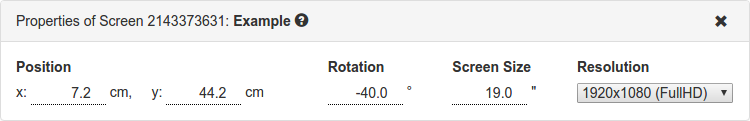

A video/image wall with freely arranged screens
===============================================

This package allows you to play videos (or images) inside a virtual
area. You can then put as many screens as you need together to cover
this area. Each screen can be freely placed or rotated.

Here is an example of what that might look like:

Let's look at how this setup is put together:

The **red** area is the _virtual content area_. This area
is where you content will play. You'll have to add at least one screen
to your configuration to actually see something. In the image above,
one of those screens is highlighted in **cyan**. You can add as many
screens as you want to cover the virtual content area. The above setup
uses 8 screens. Screens can be of any size and their areas might even
overlap.

In the configuration, this might look like this:

Setting up the virtual content area
-----------------------------------

Click on the node named _Screen Configuration_ on the left
side of the setup configuration interface.

You'll see a visualization of the virtual content area. This
area defines the physical size of a virtual canvas where
videos and images will be played. The _virtual content area_
is selected and shown in green. Below it you see its
properties:

You can set the size of the virtual area here. The values
are given in centimeters. Each change you make is reflected
in the configuration interface above. You can move around by
clicking and dragging the _virtual content area_.

If you want to change the size later, just click on the
_virtual content area_ again and you'll see its properties.

Setting up the screens
----------------------

If you want to see anything, you'll have to add screens to
your setup. At the bottom of the configuration interface,
you'll see the **Screens available** dropdown:

Select the device you want to use in your setup from the
dropdown and click on _Add Screen_. The new screen will
appear on the _virtual content area_:

You can see some of its properties like size as
well as its name and rotation. Below the visualization you
see the properties dialog:

Make sure to set the physical size of the screen (in inches)
and its native resolution here. This information is used
during playback to properly show your content.

Finally its time to move your screen to its correct position
within the _virtual content area_. Just click can drag the
screen around until it's in the position matching its
physical location. You can rotate screens by using the mouse
wheel while hovering above a screen.

You can add as many screens as you. If you want to remove a
screen, just select it by clicking on it. Once it turned
green you see its properties. Click on the **X** in the top
right corner to remove the screen. You can of course add it
again later if you wish.

Set a playlist
--------------

Click on the node labeled _Playlist Configuratio_ on the
left side of the configuration screen:

You can add images and video assets to your playlist.
If you make changes to a playlist and click on _Save_, your
devices will go black for a short moment until they are all
back in sync. Therefore it is recommended to make all
changes to a playlist and save only once.

Release history
---------------

This package is based on the
[multiscreen](https://github.com/info-beamer/multiscreen)
code so it works on [info-beamer hosted](https://info-beamer.com/hosted).

### Version 'preview'

This is the first public release. While it works, there
might be problems. If you find anything, please open an
issue on [github](https://github.com/info-beamer/package-patchwork-player/issues/new).
